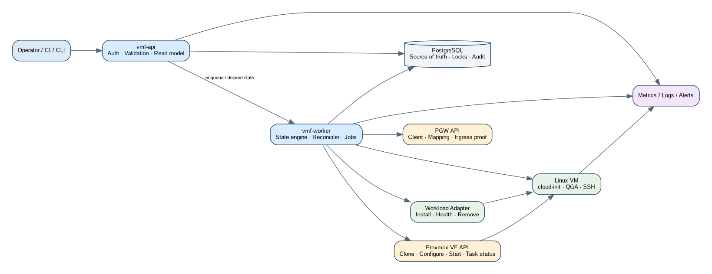
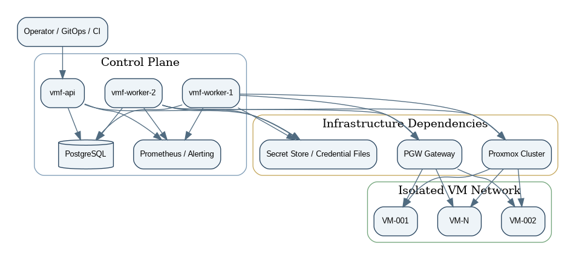

**Loại tài liệu:** Technical Design Document  
**Repository mục tiêu:** `vm-factory`  
**Phiên bản tài liệu:** 1.0  
**Trạng thái:** Dev-ready proposal  
**Ngày chốt:** 25/08/2026

> VM Factory & Fleet Control Plane là một control plane độc lập để tạo, cấu hình, xác minh, vận hành và thu hồi Linux VM trên Proxmox. PGW được tích hợp qua API như một dependency bên ngoài; VM Factory không chứa logic data-plane của PGW và không phụ thuộc vào bất kỳ workload cụ thể nào.


# 1. Architecture Drivers

Thiết kế bị chi phối bởi bảy driver:

1. **Idempotency:** retry không được tạo resource trùng.
2. **External systems are eventually consistent:** clone/start/configure là async và có thể timeout dù action vẫn tiếp tục.
3. **Partial failure is normal:** Proxmox success nhưng PGW fail, hoặc ngược lại.
4. **Identity must be observed, not assumed:** dữ liệu cloud-init request không thay thế validation từ guest.
5. **Network must exist before first workload traffic:** binding được tạo trước boot.
6. **Source of truth must be explicit:** DB lưu desired/lifecycle state; Proxmox và PGW là external resource state.
7. **Reconciliation beats imperative scripting:** worker liên tục đưa external state về desired state thay vì tin một chuỗi command một lần.

# 2. System Context

{width=95%}

## 2.1 Boundaries

```text
VM Factory owns:
- request, state machine, resource reservation
- instance inventory
- template registry
- validation evidence
- audit and lifecycle

Proxmox owns:
- VM object, virtual hardware, task execution
- storage volume and runtime state

PGW owns:
- client identity at gateway
- mapping and egress policy
- data-plane health and egress proof

Guest OS owns:
- machine identity, SSH host keys, OS/network state

Workload adapter owns:
- application-specific install/health/remove contract
```

# 3. Target Components

## 3.1 `vmf-api`

Trách nhiệm:

- AuthN/AuthZ.
- Validate request và policy.
- Idempotency key.
- Tạo desired instance/job.
- Read model: instance, job, template, capacity, validation, audit.
- Không gọi lệnh shell và không giữ quyền Proxmox trực tiếp nếu có thể tách credential sang worker.

## 3.2 `vmf-worker`

Trách nhiệm:

- Lease job từ PostgreSQL.
- Thực thi state transition.
- Gọi Proxmox, PGW, QGA/SSH và workload adapter.
- Ghi checkpoint sau mỗi side effect.
- Reconcile desired/external state.
- Retry/backoff/timeout.
- Compensating action.

Worker model:

```text
PostgreSQL job lease
+ bounded worker pool
+ per-cluster semaphore
+ per-storage semaphore
+ per-network-segment semaphore
+ context deadline
```

## 3.3 `vmf-cli`

- Operator workflow không cần UI.
- Tạo instance/batch.
- Xem job/state/evidence.
- Retry/quarantine/rebuild/decommission.
- Xuất JSON cho automation.

## 3.4 PostgreSQL

Vai trò:

- Source of truth.
- Unique constraint cho resource.
- Job queue/lease.
- Idempotency store.
- Audit append-only.
- Outbox event.

Không dùng database như log store dung lượng lớn; log chi tiết đi tới logging backend.

## 3.5 Adapters

```go
type ProxmoxAdapter interface {
    AllocateNextVMID(ctx context.Context) (int, error)
    Clone(ctx context.Context, req CloneRequest) (TaskRef, error)
    Configure(ctx context.Context, req ConfigureRequest) (TaskRef, error)
    Start(ctx context.Context, ref VMRef) (TaskRef, error)
    Stop(ctx context.Context, ref VMRef) (TaskRef, error)
    Delete(ctx context.Context, ref VMRef, purge bool) (TaskRef, error)
    GetTask(ctx context.Context, task TaskRef) (TaskStatus, error)
    GetVM(ctx context.Context, ref VMRef) (VMObservedState, error)
    GuestPing(ctx context.Context, ref VMRef) error
}
```

```go
type PGWAdapter interface {
    CreateClient(ctx context.Context, req ClientRequest) (ClientRef, error)
    CreateMapping(ctx context.Context, req MappingRequest) (MappingRef, error)
    ActivateMapping(ctx context.Context, id string) (Generation, error)
    SuspendMapping(ctx context.Context, id string) error
    DeleteMapping(ctx context.Context, id string) error
    EgressProof(ctx context.Context, clientID string) (EgressEvidence, error)
}
```

```go
type GuestTransport interface {
    WaitReady(ctx context.Context, vm VMRef) error
    Exec(ctx context.Context, vm VMRef, cmd Command) (CommandResult, error)
    Upload(ctx context.Context, vm VMRef, artifact Artifact) error
    ReadFacts(ctx context.Context, vm VMRef) (GuestFacts, error)
}
```

```go
type WorkloadAdapter interface {
    Name() string
    Validate(ctx context.Context, vm VMRef) (ValidationReport, error)
    Install(ctx context.Context, vm VMRef, spec WorkloadSpec) error
    Health(ctx context.Context, vm VMRef) (HealthReport, error)
    Remove(ctx context.Context, vm VMRef) error
}
```

# 4. Deployment Architecture

{width=95%}

## 4.1 P0 deployment

```text
1 x vmf-api
1-3 x vmf-worker
1 x PostgreSQL
1 x Prometheus-compatible collector
external: Proxmox API, PGW API, secret files/store
```

API và worker có thể chạy trên một management VM riêng, không chạy trực tiếp trên Proxmox host. Lý do:

- tránh thay đổi package/firewall trên hypervisor;
- blast radius nhỏ hơn;
- nâng cấp control plane độc lập;
- audit và secret isolation rõ hơn.

## 4.2 Network flows

| Source | Destination | Purpose | Policy |
|---|---|---|---|
| Operator | vmf-api | REST/CLI | TLS + JWT/API token |
| vmf-worker | PostgreSQL | state/lease | TLS hoặc private LAN |
| vmf-worker | Proxmox API | lifecycle | API token scoped |
| vmf-worker | PGW API | client/mapping/proof | service token/mTLS |
| vmf-worker | Guest | QGA via PVE, SSH fallback | allowlist |
| vmf-api/worker | Metrics/logging | telemetry | outbound only |

# 5. Domain Model

## 5.1 Aggregate: VM Instance

Một `vm_instance` là aggregate root cho lifecycle. Nó tham chiếu:

- template version;
- Proxmox placement;
- virtual hardware desired state;
- IP/network segment;
- egress binding;
- current state/checkpoint;
- current job;
- identity observations;
- validations;
- workload assignment.

### Invariants

1. Một instance có tối đa một active VMID.
2. Một IPv4 active chỉ thuộc một instance.
3. Một hostname active chỉ thuộc một instance trong scope.
4. Một instance READY phải có validation run PASS cho identity, network và egress.
5. Một instance RETIRED không được giữ active PGW mapping hoặc active IP allocation.
6. Template không `ACTIVE` không được dùng cho job mới.
7. Rebuild phải tạo generation mới; không ghi đè lịch sử identity observation.

## 5.2 Desired vs observed state

```text
desired_state: READY
observed_state:
  proxmox: running
  guest: reachable
  network: pass
  egress: pass
  workload: healthy
```

Nếu desired và observed lệch, reconciler quyết định:

- chờ;
- retry;
- repair;
- degrade;
- quarantine;
- rollback.

# 6. Job and State Engine

## 6.1 Job lease

Job execution state là state machine riêng (`job_state`: `QUEUED`, `RUNNING`, `RETRY_WAIT`, `SUCCEEDED`, `FAILED`, `CANCELLED`), không dùng chung enum với instance lifecycle state. Vị trí lifecycle mà job đang xử lý nằm trong cột `checkpoint`.

Worker claim job bằng transaction:

```sql
SELECT id
FROM provisioning_jobs
WHERE next_attempt_at <= now()
  AND state IN ('QUEUED','RETRY_WAIT')
ORDER BY priority DESC, created_at
FOR UPDATE SKIP LOCKED
LIMIT 1;
```

Sau đó set:

```text
lease_owner
lease_expires_at
attempt
started_at
```

Worker phải heartbeat lease. Nếu worker chết, job quay lại pool sau grace period.

## 6.2 Checkpoint

Checkpoint không chỉ là string state; nó phải chứa external references:

```json
{
  "state": "CONFIGURING",
  "pve": {
    "node": "pve01",
    "vmid": 201,
    "clone_task": "UPID:...",
    "config_generation": 3
  },
  "pgw": {
    "client_id": "cli_...",
    "mapping_id": "map_...",
    "desired_generation": 42
  }
}
```

## 6.3 Idempotency at every step

| Step | Idempotency mechanism |
|---|---|
| Create request | `Idempotency-Key` unique per tenant/scope |
| Reserve VMID/IP | DB unique constraint + reservation state |
| Clone | Search instance tag/description before new clone |
| Configure | Compare desired config hash |
| PGW client | External reference stored + create key/name deterministic |
| Mapping | One active binding constraint |
| Boot | Read current VM status before start |
| Workload install | Adapter version marker + checksum |
| Delete | Treat not-found as success after verification |

# 7. External Side-effect Pattern

Mỗi side effect dùng năm bước:

```text
1. Persist intent
2. Call external API
3. Persist external task/reference
4. Poll/read-after-write
5. Persist observed result + audit
```

Không được:

```text
call external API
→ crash
→ không lưu reference
→ retry mù
```

# 8. Resource Reservation

## 8.1 VMID

VM Factory có thể gọi `cluster/nextid`, nhưng vẫn phải reserve trong DB trước side effect. Nếu Proxmox trả VMID đã bị dùng giữa hai bước, adapter retry với VMID mới trong cùng job.

## 8.2 IPAM

Allocation state:

```text
FREE → RESERVED → ASSIGNED → QUARANTINED → RELEASED
```

Reservation có TTL. Job giữ lease sống khi provisioning đang hợp lệ.

## 8.3 Hostname

Hostname được generate từ policy:

```text
{prefix}-{sequence:04d}
```

Ví dụ:

```text
node-0001
node-0002
```

Không derive hostname từ IP để tránh coupling.

# 9. Template Registry

Template record gồm:

```text
id
name
version
os_family/os_version
architecture
pve_cluster/pve_node/template_vmid
storage
clone_mode_allowed
image_checksum
build_manifest
validation_status
state: DRAFT|CANDIDATE|ACTIVE|DEPRECATED|REVOKED
```

Promotion:

```text
DRAFT → CANDIDATE → validation suite → ACTIVE
```

Rollback template không sửa record cũ; promote version trước làm active.

# 10. API Design Principles

- REST + JSON, OpenAPI 3.1.
- Mutation trả `202 Accepted` khi có async job.
- `Idempotency-Key` bắt buộc cho create/rebuild/decommission.
- Error envelope thống nhất.
- Optimistic concurrency qua `version` hoặc `If-Match`.
- Pagination cursor-based.
- Secret write-only.

Error envelope:

```json
{
  "error": {
    "code": "IP_POOL_EXHAUSTED",
    "message": "No free IPv4 address in segment vm-lan-a",
    "details": {"segment_id": "seg_..."},
    "request_id": "req_..."
  }
}
```

# 11. Security Architecture

## 11.1 Credential model

| Credential | Scope |
|---|---|
| Proxmox token | VM/template/storage operations cần thiết |
| PGW token | clients/mappings/egress proof |
| PostgreSQL | service-specific user |
| SSH CA/key | guest bootstrap/operations |
| Workload artifact key | verify signature/checksum |

Secrets được tham chiếu bằng `secret_ref`, không lưu plaintext trong domain table.

## 11.2 Cloud-init secret hygiene

Cloud-init user data có thể tồn tại trong Proxmox config và guest logs. Vì vậy:

- không đặt long-lived API token;
- dùng short-lived bootstrap token một lần;
- rotate/revoke ngay sau bootstrap;
- tắt `emit_keys_to_console`;
- không ghi secret trong `runcmd` command line nếu có thể dùng file credential mode 0600.

## 11.3 Identity storage

Không cần lưu raw `/etc/machine-id`. Lưu:

```text
HMAC-SHA256(identity_key, machine_id)
```

để phát hiện trùng mà không biến DB thành nơi chứa identifier có thể correlation ngoài hệ.

## 11.4 No arbitrary shell

Guest command phải qua allowlisted operation:

```text
read_facts
wait_cloud_init
install_artifact
service_status
service_restart
collect_bounded_logs
```

P0 có thể dùng SSH executor nội bộ, nhưng API không nhận raw command từ user.

# 12. Observability Architecture

Correlation fields bắt buộc:

```text
request_id
job_id
instance_id
pve_cluster
pve_node
vmid
state
attempt
external_task_id
```

Metric nhóm:

- provisioning duration theo state;
- external API latency/error;
- job backlog/lease expiry;
- resource pool utilization;
- validation pass/fail;
- rollback outcome;
- orphan detection;
- template version distribution.

# 13. Failure Taxonomy

| Class | Ví dụ | Xử lý |
|---|---|---|
| Retryable transient | timeout, 502, task still running | exponential backoff |
| Retryable conflict | VMID collision, DB lock | reserve lại có giới hạn |
| Validation failure | duplicate identity, second NIC | quarantine |
| Capacity | storage full, IP pool exhausted | fail fast / alert |
| Authentication | token expired | stop retries dài, alert |
| Permanent config | bridge không tồn tại | fail + rollback |
| Unknown side effect | timeout sau clone request | reconcile/search trước retry |

# 14. Rollback Model

Compensating actions chạy ngược thứ tự side effect:

```text
remove workload
stop/delete VM
suspend/delete PGW mapping
release IP
release VMID reservation
mark job failed
```

Rollback cũng là state machine, có checkpoint riêng. Nếu rollback thất bại, instance chuyển `QUARANTINED` với resource inventory còn lại; không xóa record để che mất lỗi.

# 15. Technology Stack

| Layer | Chọn |
|---|---|
| Core | Go |
| API | `net/http` + router project-approved |
| DB | PostgreSQL, migrations versioned |
| Queue | PostgreSQL lease / SKIP LOCKED |
| Config | YAML + environment overrides |
| Metrics | Prometheus format |
| Logs | JSON structured logs |
| Tracing | OpenTelemetry optional P1 |
| CLI | Go, JSON/table output |
| UI | P1; frontend tách khỏi core |

# 16. Release and Compatibility

- Semantic versioning.
- Reproducible Go build.
- Embedded version/commit/build time.
- SHA-256 checksum và SBOM.
- DB migration forward-only; backup trước migration.
- External API contract tests với PGW và Proxmox mock.
- Feature flags cho batch, linked clone, node agent và auto-remediation.

# 17. Architecture Decision Records

Các ADR nằm trong thư mục `adr/`:

1. Go cho core services.
2. PostgreSQL làm source of truth và queue P0.
3. Reconciler/state machine thay script tuyến tính.
4. Proxmox API thay shelling out `qm` trong service.
5. QGA-first, SSH fallback.
6. PGW là external dependency.
7. HMAC identity digest, không lưu raw machine ID.
8. Full clone mặc định production.
9. IPv6 deny mặc định.
10. Không node agent trong P0.

# 18. Implementation Guardrails

Dev không được tự quyết khác tài liệu ở các điểm sau nếu chưa có ADR mới:

- Không đổi core sang Python/Node.
- Không dùng in-memory state làm production source of truth.
- Không gọi `qm` qua shell từ API service.
- Không dùng sleep cố định để chờ VM.
- Không tạo VM trước khi reserve resource.
- Không boot trước khi network/egress binding sẵn sàng.
- Không lưu plaintext secret.
- Không expose raw shell endpoint.
- Không retry external mutation mà chưa reconcile.
- Không xóa audit/resource record để “dọn lỗi”.
