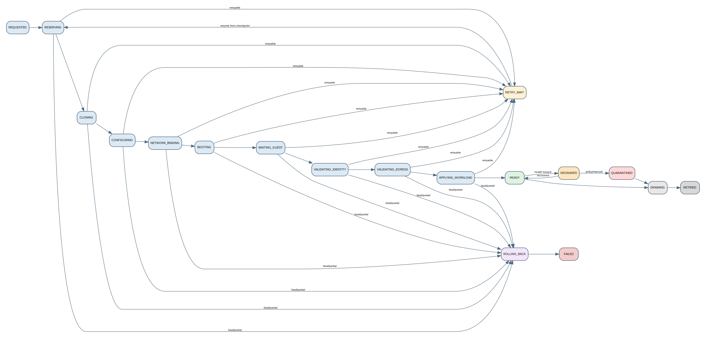

**Loại tài liệu:** State Machine Specification  
**Repository mục tiêu:** `vm-factory`  
**Phiên bản tài liệu:** 1.0  
**Trạng thái:** Dev-ready proposal  
**Ngày chốt:** 25/08/2026

> VM Factory & Fleet Control Plane là một control plane độc lập để tạo, cấu hình, xác minh, vận hành và thu hồi Linux VM trên Proxmox. PGW được tích hợp qua API như một dependency bên ngoài; VM Factory không chứa logic data-plane của PGW và không phụ thuộc vào bất kỳ workload cụ thể nào.


# 1. Nguyên tắc

State machine là contract trung tâm của VM Factory. Không cho phép code cập nhật state tùy ý. Mọi transition phải qua một transition handler có:

```text
from_state
allowed_to_state
guard
side_effect
checkpoint
timeout
retry policy
compensation
audit event
```

{width=98%}

# 2. State Groups

## 2.1 Provisioning states

```text
REQUESTED
RESERVING
CLONING
CONFIGURING
NETWORK_BINDING
BOOTING
WAITING_GUEST
VALIDATING_IDENTITY
VALIDATING_EGRESS
APPLYING_WORKLOAD
READY
```

## 2.2 Exception states

```text
RETRY_WAIT
DEGRADED
QUARANTINED
ROLLING_BACK
FAILED
```

## 2.3 Retirement states

```text
DRAINING
DECOMMISSIONING
RELEASING_RESOURCES
RETIRED
```

# 3. State Definitions

| State | Entry condition | Exit evidence |
|---|---|---|
| REQUESTED | request validated | instance/job persisted |
| RESERVING | job leased | VMID/IP/hostname/placement reserved |
| CLONING | resources reserved | VM exists and clone task success/recovered |
| CONFIGURING | VM exists | desired config observed |
| NETWORK_BINDING | VM config known | PGW binding active/reconciled |
| BOOTING | network ready | VM running |
| WAITING_GUEST | VM running | QGA/SSH + cloud-init ready |
| VALIDATING_IDENTITY | guest ready | identity report PASS |
| VALIDATING_EGRESS | network report PASS prerequisite | egress proof PASS |
| APPLYING_WORKLOAD | validations PASS | adapter health PASS |
| READY | all gates PASS | steady-state health evidence |
| DEGRADED | health breach | recovered or quarantine decision |
| QUARANTINED | unsafe/unknown state | operator/remediation decision |
| ROLLING_BACK | provisioning fatal | compensation terminal |
| FAILED | job terminal failure | manual retry/new job only |
| DRAINING | retire requested | workload stopped/drained |
| RETIRED | resources released | immutable historical record |

# 4. Transition Contract

## 4.1 REQUESTED → RESERVING

Guard:

- template active;
- segment active;
- request idempotency valid;
- capacity policy not hard-blocked.

Side effects: none ngoài DB.

## 4.2 RESERVING → CLONING

Transaction reserve:

```text
placement
VMID
IPv4
hostname
workload slot
```

Nếu thiếu capacity, fail `CAPACITY_UNAVAILABLE` không gọi external API.

## 4.3 CLONING → CONFIGURING

Evidence:

- external VM ref persisted;
- clone task terminal success hoặc recovered by reconciliation;
- external tag matches instance ID.

## 4.4 CONFIGURING → NETWORK_BINDING

Evidence:

- CPU/RAM/disk/NIC/cloud-init desired config observed;
- no unexpected NIC;
- config hash matches.

## 4.5 NETWORK_BINDING → BOOTING

Evidence:

- PGW client exists;
- mapping exists and active;
- desired generation applied;
- optional initial egress path probe at gateway.

## 4.6 BOOTING → WAITING_GUEST

Read-before-write:

- if VM already running, do not issue duplicate start;
- start task persisted;
- observed running.

## 4.7 WAITING_GUEST → VALIDATING_IDENTITY

Evidence:

- QGA ping or approved SSH fallback;
- cloud-init terminal success;
- expected IPv4 observed.

## 4.8 VALIDATING_IDENTITY → VALIDATING_EGRESS

Checks:

- machine ID digest unique;
- MAC/hostname/IP match inventory;
- SSH host key fingerprint unique;
- one NIC;
- one IPv4 default route;
- no IPv6 default route;
- no stale application state.

## 4.9 VALIDATING_EGRESS → APPLYING_WORKLOAD

- PGW egress proof PASS;
- expected mapping/client;
- no direct-route anomaly;
- proof timestamp within policy window.

## 4.10 APPLYING_WORKLOAD → READY

- artifact checksum/signature verified;
- install marker version matches;
- service health PASS;
- final evidence snapshot persisted.

# 5. Retry Policy

Retry classification:

```text
TRANSIENT: network timeout, 502/503, task running
CONFLICT: VMID race, DB lock
CAPACITY: storage/IP exhausted
AUTH: invalid/expired token
VALIDATION: identity/network mismatch
PERMANENT: bad bridge/template/config
UNKNOWN_SIDE_EFFECT: timeout after mutation
```

Backoff:

```text
transient: exponential + jitter, max attempts configurable
conflict: short retry + resource re-reservation
capacity: no hot loop; retry after capacity event/manual
validation: quarantine, not blind retry
auth: alert and pause integration
unknown side effect: reconcile before any reissue
```

# 6. Rollback State Machine

```text
ROLLING_BACK
  1. stop/remove workload if applied
  2. stop/delete VM if owned by instance
  3. suspend/delete PGW mapping/client
  4. release IP/hostname/VMID reservation
  5. mark external leftovers
  6. terminal FAILED or QUARANTINED
```

Compensation step cũng idempotent. Không stop rollback vì một delete trả not-found.

# 7. Quarantine Policy

Quarantine dùng khi:

- duplicate identity;
- unknown VM ownership/tag mismatch;
- second NIC/default route unexpected;
- egress proof mismatch;
- rollback không xóa được resource;
- workload state không xác định;
- manual security hold.

Quarantine action:

```text
suspend egress mapping
optionally stop VM
retain evidence/log references
block automatic reuse of IP/proxy binding
alert operator
```

# 8. Rebuild Workflow

Rebuild không mutate instance generation cũ. Nó tạo:

```text
same logical instance_id
+ generation N+1
+ new provisioning job
+ new VM external reference
+ new identity observation
```

Policy có thể giữ hoặc đổi IP/hostname/egress binding. Generation cũ chuyển `REPLACED`/retired sau cutover.

# 9. Decommission Workflow

```text
READY/QUARANTINED
→ DRAINING
→ DECOMMISSIONING
→ RELEASING_RESOURCES
→ RETIRED
```

Operator không được xóa VM trực tiếp qua VM Factory API mà bỏ qua drain/release. Emergency purge là quyền riêng, bắt buộc reason và audit.

# 10. Event Model

Mỗi transition emit domain event vào outbox:

```json
{
  "event_id": "evt_...",
  "type": "vm_instance.state_changed",
  "instance_id": "ins_...",
  "job_id": "job_...",
  "from": "CONFIGURING",
  "to": "NETWORK_BINDING",
  "occurred_at": "...",
  "correlation_id": "req_..."
}
```

# 11. State Engine Tests

- Mọi allowed transition.
- Mọi forbidden transition.
- Worker crash trước/sau checkpoint.
- Lease expiry and takeover.
- Retry không tăng resource count.
- Rollback từng step fail.
- Quarantine guard.
- Rebuild generation.
- Decommission idempotency.
- Audit/outbox transaction cùng state update.
