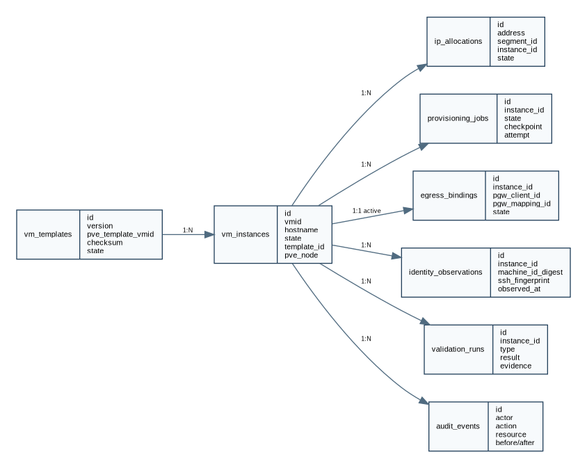

**Loại tài liệu:** Data Design Specification  
**Repository mục tiêu:** `vm-factory`  
**Phiên bản tài liệu:** 1.0  
**Trạng thái:** Dev-ready proposal  
**Ngày chốt:** 25/08/2026

> VM Factory & Fleet Control Plane là một control plane độc lập để tạo, cấu hình, xác minh, vận hành và thu hồi Linux VM trên Proxmox. PGW được tích hợp qua API như một dependency bên ngoài; VM Factory không chứa logic data-plane của PGW và không phụ thuộc vào bất kỳ workload cụ thể nào.


# 1. Data Principles

1. PostgreSQL là source of truth cho desired/lifecycle state.
2. External resource state được lưu như observation, không thay source of truth của Proxmox/PGW.
3. Unique constraint thay cho kiểm tra application-only.
4. Resource reservation là first-class entity.
5. Audit append-only.
6. Secret tách khỏi business tables.
7. Raw machine ID không lưu; dùng HMAC digest.
8. Soft-delete/retention cho record lịch sử; external resource có thể bị delete thật.

{width=92%}

# 2. Core Tables

## 2.1 `vm_templates`

```text
id UUID PK
name TEXT
version TEXT
family TEXT
os_family TEXT
os_version TEXT
architecture TEXT
pve_cluster_id UUID
pve_node TEXT
pve_template_vmid INT
storage TEXT
source_checksum TEXT
build_manifest JSONB
state ENUM
validation_status ENUM
created_at/updated_at
UNIQUE(family, version)
```

## 2.2 `vm_instances`

```text
id UUID PK
logical_name TEXT
hostname TEXT
state ENUM
generation INT
template_id UUID FK
pve_cluster_id UUID
pve_node TEXT
vmid INT
resource_pool TEXT
desired_config JSONB
desired_config_hash TEXT
workload_adapter TEXT
workload_spec JSONB
version BIGINT
created_at/updated_at/retired_at
```

Unique partial indexes:

```text
(pve_cluster_id, vmid) WHERE retired_at IS NULL
hostname WHERE retired_at IS NULL
(logical_name, generation)
```

## 2.3 `network_segments`

```text
id UUID PK
name TEXT UNIQUE
cidr CIDR
gateway INET
bridge TEXT
dns_servers INET[]
ipv6_policy TEXT
allocation_strategy TEXT
state TEXT
```

## 2.4 `ip_allocations`

```text
id UUID PK
segment_id UUID FK
address INET
instance_id UUID NULL
state ENUM
reserved_until TIMESTAMPTZ
assigned_at/released_at
UNIQUE(segment_id, address)
```

## 2.5 `egress_bindings`

```text
id UUID PK
instance_id UUID FK
pgw_client_id TEXT
pgw_mapping_id TEXT
pgw_policy_id TEXT
state ENUM
expected_exit JSONB
desired_generation BIGINT
last_proof_at TIMESTAMPTZ
created_at/updated_at
```

Một partial unique active binding per instance.

## 2.6 `provisioning_jobs`

`state` dùng enum `job_state` riêng (`QUEUED|RUNNING|RETRY_WAIT|SUCCEEDED|FAILED|CANCELLED`), không dùng chung `instance_state`; `checkpoint` giữ vị trí lifecycle.

```text
id UUID PK
instance_id UUID FK
operation ENUM
state ENUM(job_state)
checkpoint TEXT
checkpoint_data JSONB
priority INT
attempt INT
max_attempts INT
next_attempt_at TIMESTAMPTZ
lease_owner TEXT
lease_expires_at TIMESTAMPTZ
error_code TEXT
error_message TEXT
created_at/started_at/finished_at
```

## 2.7 `external_tasks`

Lưu task reference từ Proxmox/PGW:

```text
id UUID PK
job_id UUID FK
system TEXT
operation TEXT
external_id TEXT
status TEXT
request_hash TEXT
started_at/last_polled_at/finished_at
result JSONB
UNIQUE(system, external_id)
```

## 2.8 `identity_observations`

```text
id UUID PK
instance_id UUID FK
generation INT
machine_id_digest TEXT
ssh_host_fingerprint TEXT
cloud_init_instance_id TEXT
hostname TEXT
mac_addresses MACADDR[]
ip_addresses INET[]
boot_id TEXT
facts JSONB
observed_at TIMESTAMPTZ
```

Unique digest policy có thể theo active instances hoặc toàn lịch sử tùy compliance; mặc định cảnh báo nếu digest từng xuất hiện ở logical instance khác.

## 2.9 `validation_runs`

```text
id UUID PK
instance_id UUID FK
job_id UUID FK
type ENUM(identity, network, egress, workload, template)
result ENUM(pass, fail, warn)
evidence JSONB
ruleset_version TEXT
started_at/finished_at
```

## 2.10 `audit_events`

```text
id UUID PK
occurred_at TIMESTAMPTZ
actor_type TEXT
actor_id TEXT
action TEXT
resource_type TEXT
resource_id TEXT
request_id TEXT
correlation_id TEXT
before JSONB
after JSONB
metadata JSONB
```

Application không expose update/delete. Retention/archival qua privileged maintenance procedure.

## 2.11 `idempotency_keys`

```text
scope TEXT
key TEXT
request_hash TEXT
response_status INT
response_body JSONB
resource_id UUID
expires_at TIMESTAMPTZ
PRIMARY KEY(scope, key)
```

Cùng key nhưng request hash khác trả `IDEMPOTENCY_CONFLICT`.

## 2.12 `resource_locks`

Dùng cho reservation cross-worker:

```text
resource_type
resource_key
owner_job_id
lease_expires_at
PRIMARY KEY(resource_type, resource_key)
```

# 3. IPAM Allocation

## 3.1 Strategy

P0 hỗ trợ:

- sequential-lowest-free;
- explicit requested IP;
- reserved ranges/exclusions.

Không cấp:

```text
network address
broadcast
gateway
reserved/excluded
active/reserved/quarantined address
```

## 3.2 Transaction

```sql
SELECT id, address
FROM ip_allocations
WHERE segment_id = $1 AND state = 'FREE'
ORDER BY address
FOR UPDATE SKIP LOCKED
LIMIT 1;
```

Update `RESERVED`, set `instance_id` và TTL trong cùng transaction tạo job/resource reservation.

## 3.3 Reaper

Reservation reaper chỉ release khi:

- TTL expired;
- job không active/leased;
- no external VM or mapping observed;
- audit event written.

# 4. Capacity Registry

Tables/observations:

```text
pve_clusters
pve_nodes
pve_storages
capacity_snapshots
```

Capacity snapshot là observation có TTL, không được coi là hard transaction guarantee. Mutation vẫn phải xử lý race.

# 5. Consistency Model

## 5.1 Strong consistency trong DB

- instance + job + reservations created cùng transaction;
- state transition + audit + outbox cùng transaction;
- mapping reference persist trước activate;
- unique constraints enforce identity/resource.

## 5.2 Eventual consistency external

- Proxmox task async;
- PGW reconcile async;
- guest readiness async.

Worker poll/reconcile đến khi evidence terminal hoặc timeout policy.

# 6. Retention

| Data | Retention |
|---|---|
| Active instance | permanent |
| Retired instance metadata | >= 1 năm hoặc policy |
| Audit | >= 1 năm; archive cold storage |
| Validation evidence | >= 180 ngày |
| Job details | >= 180 ngày |
| Raw logs | logging backend policy |
| Secret versions | until rotation grace ends |

# 7. Migration Strategy

- `schema_migrations` forward-only.
- Migration chạy bởi dedicated command trước app rollout.
- Backup bắt buộc trước destructive migration.
- Expand/contract cho zero/low downtime.
- Application startup kiểm tra compatible schema version.

# 8. Backup and Restore

Backup:

```text
PostgreSQL logical backup daily
+ WAL/physical backup theo RPO
+ encrypted off-host copy
+ restore drill định kỳ
```

Restore không tự động tái chạy external side effects. Sau restore phải chạy reconciliation mode read-only trước, inventory Proxmox/PGW, sau đó operator approve repair.

# 9. Secrets

Secret table chỉ lưu ciphertext metadata nếu không dùng external secret manager:

```text
id
provider
ciphertext
nonce
key_version
created_at
rotated_at
```

AES-GCM envelope key từ systemd credential hoặc secret manager. Không lưu key trong DB.

# 10. Query/Index Requirements

Indexes tối thiểu:

- jobs by state/next_attempt/priority;
- instances by state/pve node/template;
- active IP allocations;
- external tasks by external ID;
- validation by instance/type/time;
- audit by resource/time/correlation;
- identity digest.

# 11. Data Quality Checks

Periodic invariant scanner:

```text
active instance without active IP
READY without PASS validations
retired instance with active mapping
duplicate VMID/IP/hostname/digest
job lease expired but state running
DB VM missing in Proxmox
Proxmox VM tagged VMF missing in DB
PGW mapping missing/orphaned
```

Kết quả không tự delete; tạo finding và remediation job có approval policy.
